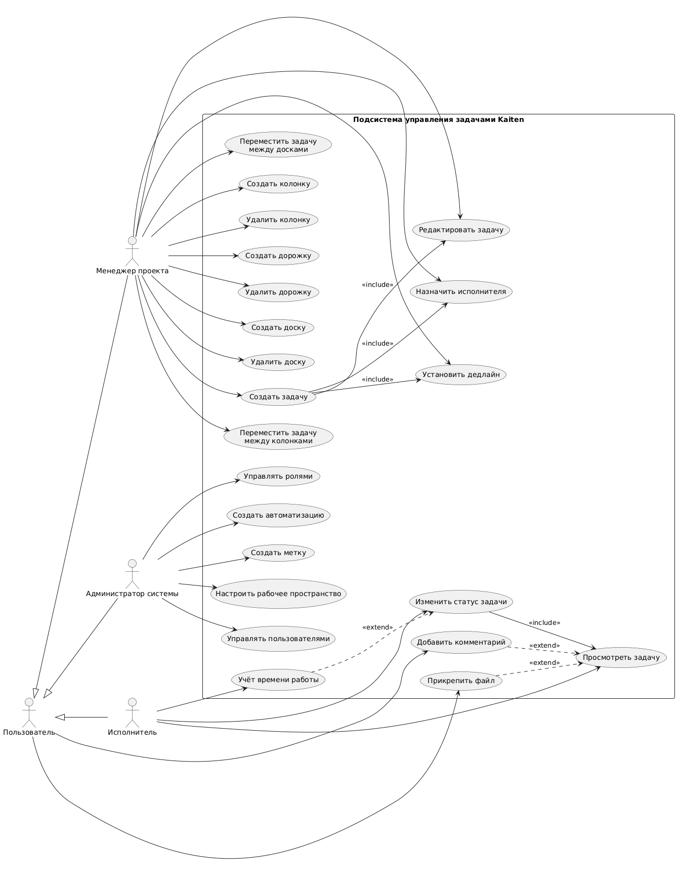

# Анализ подсистемы управления задачами в сервисе Kaiten

## Вариант: Kaiten

**Kaiten** – сервис для управления личными задачами и организации работы команд любого масштаба, основанный на принципах подхода Kanban и методологии Agile. С помощью него можно визуализировать рабочие процессы, расставить приоритеты и отслеживать прогресс задач.

### Ход работы

Для анализа я выбрал подсистему управления задачами. Необходимо выделить основных акторов и определить их сценарии использования этой подсистемы.

### Основные акторы и их действия

| Менеджер проекта | Исполнитель | Администратор |
|------------------|-------------|---------------|
| Создать задачу | Просмотреть задачу | Управлять пользователями |
| Редактировать задачу | Изменить статус задачи | Управлять ролями |
| Назначить исполнителя | Добавить комментарий | Создать автоматизацию |
| Установить дедлайн | Прикрепить файл | Создать метку |
| Переместить задачу между колонками | Зафиксировать затраченное время | Настроить рабочее пространство |
| Переместить задачу между досками | | |
| Добавить комментарий | | |
| Создать колонку | | |
| Удалить колонку | | |
| Создать дорожку | | |
| Удалить дорожку | | |
| Создать доску | | |
| Удалить доску | | |

## 1. Описание сценариев использования

### Use Case: Создание задачи

| Параметр | Содержание |
|----------|------------|
| **Актор** | Менеджер проекта |
| **Предусловие** | - Пользователь авторизован в качестве менеджера - Пользователь имеет права доступа к соответствующему пространству - В пространстве существует доска |
| **Поток событий** | 1. Менеджер открывает доску проекта 2. Менеджер выбирает действие "Создать задачу" 3. Система отображает форму создания задачи 4. Менеджер вводит название и описание 5. Менеджер сохраняет задачу 6. Система создаёт карточку задачи на доске |
| **Постусловие** | Задача создана и отображается на доске проекта |
| **Инвариант** | Каждая задача принадлежит доске и находится в одной из её колонок |

### Use Case: Назначение исполнителя

| Параметр | Содержание |
|----------|------------|
| **Актор** | Менеджер проекта |
| **Предусловие** | Задача уже создана и менеджер имеет доступ к доске, на которой находится задача |
| **Поток событий** | 1. Менеджер открывает карточку задачи 2. Менеджер выбирает действие редактирования задачи 3. Система отображает параметры задачи 4. Менеджер в поле «Исполнитель» выбирает пользователя из списка 5. Менеджер сохраняет изменения 6. Система обновляет карточку задачи и назначает выбранного пользователя исполнителем |
| **Постусловие** | Исполнитель назначен задаче и получает уведомление о назначении |
| **Инвариант** | Задача остаётся привязанной к своей доске и колонке |
| **Альтернативный поток событий** | 1. Менеджер выбирает пользователя, который не имеет доступа к данному пространству 2. Система отклоняет назначение и выводит сообщение об ошибке 3. Менеджер выбирает другого пользователя |

### Use Case: Изменение статуса задачи

| Параметр | Содержание |
|----------|------------|
| **Актор** | Исполнитель или Менеджер проекта |
| **Предусловие** | Задача существует и доступна пользователю на доске проекта |
| **Поток событий** | 1. Пользователь открывает карточку задачи 2. Пользователь выбирает действие изменения статуса задачи 3. Система отображает доступные статусы задачи 4. Пользователь выбирает новый статус 5. Система обновляет статус задачи 6. Система сохраняет изменения и уведомляет участников задачи |
| **Постусловие** | Статус задачи изменён и отображается на доске |
| **Инвариант** | Задача остаётся привязанной к своей доске и находится в одной из её колонок |
| **Альтернативный поток событий** | 1. Пользователь изменяет статус задачи на «Завершена» 2. Система фиксирует завершение задачи 3. Система уведомляет всех участников задачи о завершении |

### Use Case: Добавление комментария к задаче

| Параметр | Содержание |
|----------|------------|
| **Актор** | Исполнитель или Менеджер проекта |
| **Предусловие** | Пользователь авторизован и имеет доступ к карточке задачи |
| **Поток событий** | 1. Пользователь открывает карточку задачи 2. Пользователь вводит текст комментария в поле комментариев 3. Пользователь отправляет комментарий 4. Система сохраняет комментарий в карточке задачи 5. Система уведомляет участников задачи о новом комментарии |
| **Постусловие** | Комментарий сохранён и отображается в карточке задачи |
| **Инвариант** | Задача остаётся привязанной к своей доске и находится в одной из её колонок |
| **Альтернативный поток событий** | 1. Пользователь пытается отправить пустой комментарий 2. Система отклоняет отправку и отображает сообщение об ошибке |

### Use Case: Учёт времени работы

| Параметр | Содержание |
|----------|------------|
| **Актор** | Исполнитель |
| **Предусловие** | Исполнитель назначен на задачу и имеет доступ к карточке задачи |
| **Поток событий** | 1. Исполнитель открывает карточку задачи 2. Исполнитель запускает таймер учёта времени работы 3. Система начинает фиксировать время работы над задачей 4. Исполнитель останавливает таймер после завершения или паузы работы 5. Система сохраняет зафиксированное время в карточке задачи |
| **Постусловие** | Затраченное время сохранено и отображается в карточке задачи |
| **Инвариант** | Задача остаётся привязанной к своей доске и находится в одной из её колонок |

## 2. Use-Case UML Диаграмма

