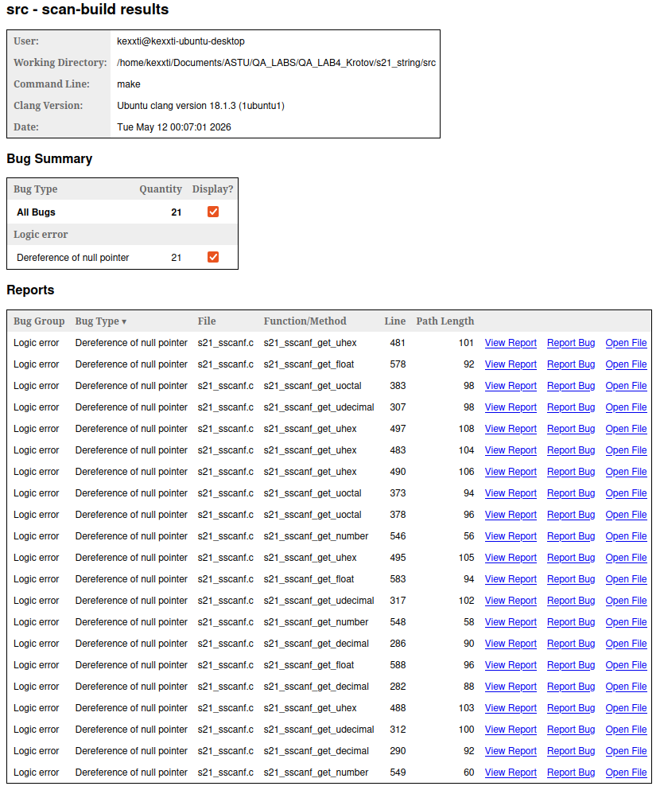
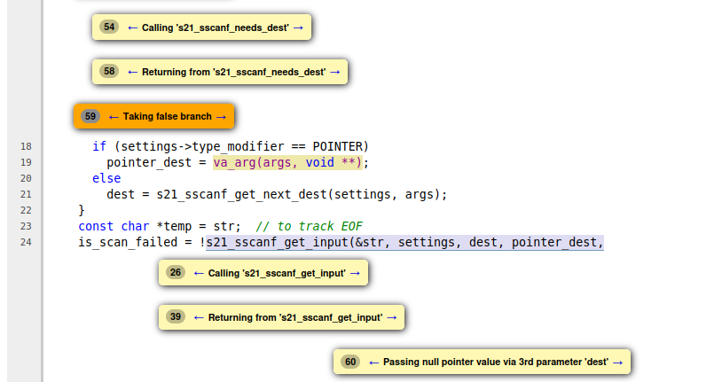
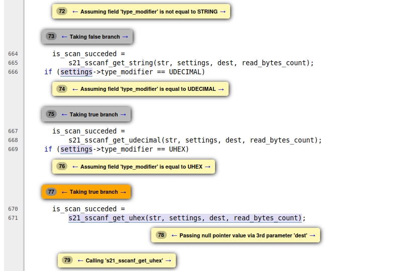
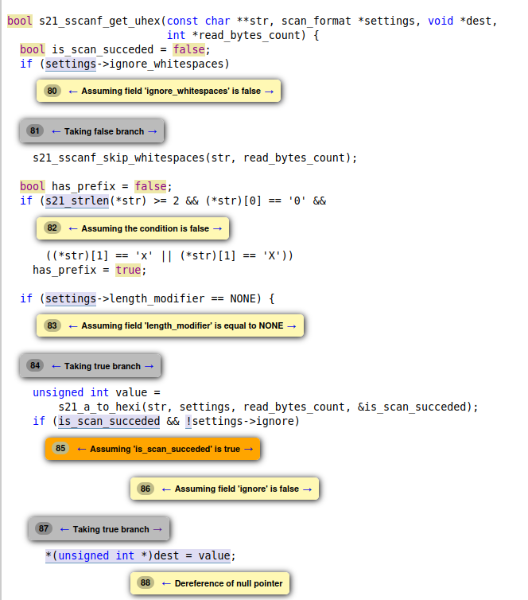

# Лабораторная работа №4  
## Статические и динамические анализаторы

# Ход работы

## Задание 1 & 2
### Статический анализ и описание результата (полезного и ложноположительного) 

В качестве проекта для анализа я выбрал реализацию библиотеки `string.h` из стандартной библиотеки `C`. 
Думаю, что этот проект будет богат на различные ошибки. Чего только стоят реализации `sscanf` и `sprintf`.

Поскольку на проектах я часто применял `clang-format` в качестве линтера, в качестве статического анализатора я выбррал `clang static analyzer`, который на Ubuntu поставляется в пакете `clang-tools`.
А именно модуль `scan-build`

Цитата из [документации](https://clang.llvm.org/docs/analyzer/user-docs/CommandLineUsage.html#:~:text=2%2E1%2E2%2E3%2E%20Basic%20Usage):

```bash
2.1.2.3. Basic Usage

Basic usage of scan-build is designed to be simple: just place the word “scan-build” in front of your build command:
    
    $ scan-build make
    
```

Так и поступим. Все манипуляции необходимо выполнять из папки [s21_strin/src/](./s21_string/src/)

```bash
    scan-build -v -V make 
```

Прим. 
- `-v` verbose (подробный вывод)
- `-V` View (автоматически открыть сгенерированный index.html)

На выходе статический анализатор `scan-build` обнаружил `21` предупреждение типа:

```text
Dereference of null pointer
```

Большинство предупреждений относятся к функциям парсинга `s21_sscanf`, например:

- `s21_sscanf_get_decimal`
- `s21_sscanf_get_float`
- `s21_sscanf_get_uhex`

Интересно, что в проекте `s21_string` анализатор обнаружил ровно `21` предупреждение.



Попытаемся проанализировать причину возникновения предупреждений.

Упрощенно поток управления функции `s21_sscanf()` можно представить следующим образом:

```text
START
  |
  v
init counters
  |
  v
while(format not empty && no errors)
  |
  +--> reset settings
  |
  +--> parse format specifier
  |
  +--> determine destination pointer
  |
  +--> parse input
  |
  +--> update counters
  |
  +--> check EOF
  |
  v
cleanup
  |
  v
return scans_count / EOF
```

Статический анализатор использует symbolic execution и анализирует различные возможные пути выполнения программы.

Внутри `s21_sscanf()` указатель `dest` изначально инициализируется значением `NULL`:

```c
void *dest = NULL;
```



Далее указатель инициализируется только при выполнении условия:

```c
if (s21_sscanf_needs_dest(settings))
```



После этого `dest` передается в функции парсинга, где происходит разыменование указателя:

```c
*(int *)dest = value;
```



Анализатор не смог доказать, что во всех путях выполнения программы перед разыменованием `dest` обязательно был корректно инициализирован.

Из-за сложного потока управления, использования variadic arguments (`va_list`) и диспетчеризации через `type_modifier`, анализатор допустил возможность существования пути, в котором `dest == NULL`, после чего сообщил о потенциальном разыменовании нулевого указателя.

Но при рассмотрении логики программы вживую можно заметить, что при корректной работе `s21_sscanf()` такой путь выполнения недостижим.

Таким образом, данное предупреждение можно классифицировать как ложноположительное срабатывание (false positive).

## Задание 3
### Динамический анализ кода

В качестве динамического анализатора я буду использовать `valgrind`.


В [Makefile](./s21_string/src/Makefile) добавим вот такой `target`:

```Makefile
test_leaks: tests/*.c s21_string.a
	$(CC) $(CFLAGS) $(GCOV_FLAGS) $^ -o $(LOGS_F)/$@ $(LDLIBS)

ifeq ($(OS),Darwin)
	leaks -atExit -- ./$(LOGS_F)/$@ > $(LOGS_F)/leaks.log
	grep -n "LEAK:" $(LOGS_F)/leaks.log ||:
else ifeq ($(OS),Linux)
	valgrind --leak-check=full --log-file=$(LOGS_F)/valgrind.log ./$(LOGS_F)/$@
	grep -n "ERROR SUMMARY:" $(LOGS_F)/valgrind.log | grep -v "0 errors" ||:
endif
```
Смотрим на хостовую ОС и в зависимости от этого запускаем динамический анализатор кода. Затем делаем `grep` по строкам `ERROR SUMMARY` и выводим те из них, которые отличны от шаблона `"0 errors"`.

Из директории [s21_strin/src/](./s21_string/src/) выполним:

```bash
    make test_leaks
```

Получаем довольно скучный вывод: 

```bash
Running suite(s): s21_strncat
 s21_strchr
 s21_strrchr
 s21_strcspn
 s21_insert
 s21_strlen
 s21_strncpy
 s21_strstr
 s21_memchr
 s21_memcmp
 s21_memcpy
 s21_trim
 s21_to_lower
 s21_to_upper
 s21_memset
 s21_sscanf
 s21_strtok
 s21_strpbrk
 s21_strncmp
 s21_strerror
 s21_sprintf
100%: Checks: 201, Failures: 0, Errors: 0
grep -n "ERROR SUMMARY:" reports/valgrind.log | grep -v "0 errors" ||:
```

Тогда попробуем добавить ошибки руками и посмотрим как на нас будут ругаться.

Добавим для начала вот такой вот тест в один из тестовых наборов: 

```c++
START_TEST(memory_leak_test) {
    char *ptr = malloc(128);

    ptr[0] = 'A';

    // free(ptr); специально отсутствует
}
END_TEST
```

После этого еще раз выполнив `make test_leaks` получим:

```log 
==265964== HEAP SUMMARY:
==265964==     in use at exit: 28,711 bytes in 975 blocks
==265964==   total heap usage: 2,298 allocs, 1,323 frees, 1,858,325 bytes allocated
==265964== 
==265964== 128 bytes in 1 blocks are definitely lost in loss record 575 of 582
==265964==    at 0x4846828: malloc (in /usr/libexec/valgrind/vgpreload_memcheck-amd64-linux.so)
==265964==    by 0x125177: memory_leak_test_fn (in /home/kexxti/Documents/ASTU/QA_LABS/QA_LAB4_Krotov/s21_string/src/reports/test_leaks)
==265964==    by 0x166702: srunner_run_tagged (in /home/kexxti/Documents/ASTU/QA_LABS/QA_LAB4_Krotov/s21_string/src/reports/test_leaks)
==265964==    by 0x116228: main (in /home/kexxti/Documents/ASTU/QA_LABS/QA_LAB4_Krotov/s21_string/src/reports/test_leaks)
==265964== 
==265964== LEAK SUMMARY:
==265964==    definitely lost: 128 bytes in 1 blocks
==265964==    indirectly lost: 0 bytes in 0 blocks
==265964==      possibly lost: 0 bytes in 0 blocks
==265964==    still reachable: 28,583 bytes in 974 blocks
==265964==         suppressed: 0 bytes in 0 blocks
==265964== Reachable blocks (those to which a pointer was found) are not shown.
==265964== To see them, rerun with: --leak-check=full --show-leak-kinds=all
==265964== 
==265964== For lists of detected and suppressed errors, rerun with: -s
==265964== ERROR SUMMARY: 1 errors from 1 contexts (suppressed: 0 from 0)
```

`definitely lost: 128 bytes in 1 blocks` - это то чего мы и добивались. `Valgrind` обнаружил искусственно организованную утечку памяти.

# Вывод

В ходе лабораторной работы были изучены инструменты статического и динамического анализа кода.

С помощью статического анализатора `scan-build` были исследованы возможные ошибки в реализации `s21_sscanf`. Анализатор обнаружил предупреждения типа `Dereference of null pointer`, однако после анализа потока управления программы было установлено, что предупреждения являются ложноположительными срабатываниями (`false positive`), связанными с ограничениями статического анализа сложных ветвлений, variadic arguments и косвенной диспетчеризации.

Также был использован динамический анализатор `Valgrind`. Для демонстрации его работы в проект была добавлена искусственная утечка памяти, которая была успешно обнаружена во время выполнения программы.

Следует отметить, что возможности динамического анализа не ограничиваются только поиском утечек памяти. Подобные инструменты также позволяют обнаруживать ошибки работы с памятью, использование неинициализированных данных, выход за границы массива, двойное освобождение памяти и другие runtime-проблемы. Однако в рамках данной лабораторной работы основное внимание было уделено анализу утечек памяти.