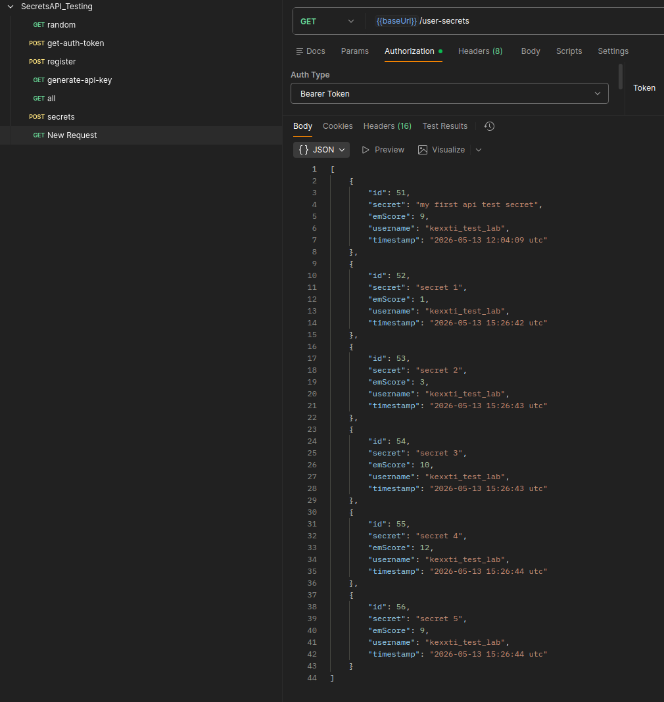
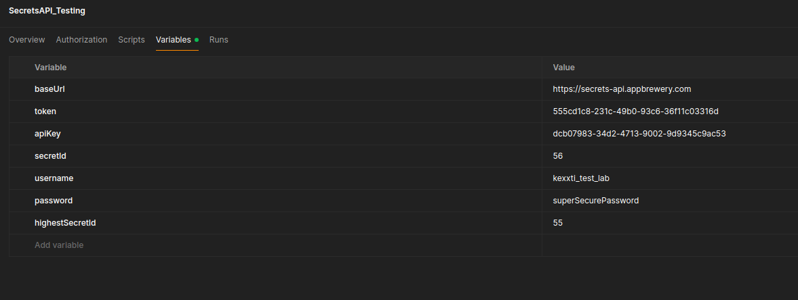

# Лабораторная работа №5 
## Тестирование сетевого API

В качестве API для тестирования я выбрал [Secrets API](https://secrets-api.appbrewery.com/). 
Этот ***учебный*** API позволяет анонимно управлять секретами и получать их.

Примечание из документации: `All user submitted data (including registration, tokens, usernames, passwords, secrets) are erased on a regular basis.`

## Ход работы

### Простой запрос

В документации указан 1 запрос, который не требует аутентификации - `GET /random`

Попробуем сделать запрос.

Для этого, предварительно создав переменные окружения выполняем запрос: 

```bash
    GET {{baseUrl}}/random
```

Получаем следующий ответ:

```json
{
    "id": 44,
    "secret": "I've convinced my friends that I have a secret talent for beatboxing, but I can only make strange noises.",
    "emScore": 4,
    "username": "beatboxcharlatan",
    "timestamp": "2023-06-27 07:07:11 utc"
}
```

Убедившись, что API функционален можем идти дальше.

### Аутентификация

Этот API поддерживает разные способы аутентификации для разных эндпоинтов, чем мне он и понравился.

Начнем с того, что зарегистрируем пользователя создадим тест для проверки статус кода.

Будем выполнять такой запрос:

```bash
    POST {{baseUrl}}/register
```

С телом:

```json
    {
        "username": "{{usename}}",
        "password": "{{password}}"
    }
```

А также создадим скрипт

```js 
    pm.test("Status test", function () {
        pm.response.to.have.status(200);
    })
```

Получаем сообщение об успешной регистрации и зеленый результат теста в ответ.

#### Получение токена

Будем выполнять такой запрос:

```bash
    POST {{baseUrl}}/get-auth-token
```

С телом:

```json
    {
        "username": "{{usename}}",
        "password": "{{password}}"
    }
```

А также создадим скрипт

```js 
    pm.test("Token received", function () {
    const json = pm.response.json();

    pm.expect(json.token).to.exist;

    pm.collectionVariables.set(
        "token",
        json.token
        );
    });
```

Получаем сообщение с токеном в ответ, а также теперь переменная token содержит полученное значение.

#### Получение ключа

Будем выполнять такой запрос:

```bash
    GET /generate-api-key
```

А также создадим скрипт

```js 
    pm.test("apiKey Received", function () {
    const json = pm.response.json();

    pm.expect(json.apiKey).to.exist;

    pm.collectionVariables.set(
        "apiKey",
        json.apiKey
    );
})
```
Получаем сообщение с токеном в ответ, а также теперь переменная apiKey содержит полученное значение.


### REST API

Теперь после получения всех способов аутентификации можно перейти к тестированию самого API по созданию, редактированию и удалению секретов


#### Список всех секретов

Посмотрим на все доступные секреты. Этот запрос требует `Basic` аутентификации, а также имеет `Query` параметре: `page` - страница извлекаемой информации.

Выполняем вот такой запрос

```bash
    GET {{baseUrl}}/all?page=1
```
С вот такой проверкой на валидность и не пустое тело:

```js
    pm.test("response must be valid and have a body", function () {
        pm.response.to.be.ok;
        pm.response.to.be.withBody;
        pm.response.to.be.json;
    });
```

В ответ получаем первую страницу доступных секретов. 

#### Пост секрета

Настало время делиться секретами. Этот запрос требует `Bearer token` аутентификации и заполненного `body`. 

Будем выполнять такой запрос:

```bash
    POST /secrets
```

С телом:

```json
    {
        "secret": "my first api test secret",
        "score": 1
    }
```

А также создадим скрипт, который проверяет, что секрет создан и сохраняет его id в переменные коллекции.

```js 
    pm.test("Secret created", function () {
    const json = pm.response.json();

    pm.expect(json.id).to.exist;

    pm.collectionVariables.set(
        "secretId",
        json.id
        );
    });
```

Получаем ответ об успешном создании секрета.

---

Попробуем создать несколько секретов при запуске runner'a. Создадим [.json файл](./secrets.json) и при запуске runner'а укажем его.

При этом изменим тело запроса `secrets`:
```js
    {
        "secret": "{{secret}}",
        "score": "{{score}}"
    }
```

Все запросы выполнились успешно. Посмотрим теперь на созданные запросы при помощи `GET /user-secrets`



То, что нужно!

#### Добавление тестов и подготовка к автоматизации

Сначала добавим вот такие тесты в `GET /user-secrets`

```js

    const json = pm.response.json();

    pm.test("Response is array", function () {
        pm.expect(json).to.be.an("array");
    });

    pm.test("User has secrets", function () {
        pm.expect(json.length).to.be.above(0);
    });

    const highest = json.reduce((a, b) =>
        a.emScore > b.emScore ? a : b
    );

    pm.collectionVariables.set(
        "highestSecretId",
        highest.id
    );
```

Будем среди всех созданных секретов искать "самый стыдный" (embarrassing score) и позже удалим его.

Выполним запрос еще раз и посмотрим что мы добавили новую переменную.



#### Фильтрация

Перед удалением выполним еще запрос на фильтрацию, т.к. это единственный метод, требующий аутентификации по `apiKey`.


Будем выполнять такой запрос:

```bash
    GET /filter
```

С параметрами:

```markdown
    - apiKey: Your API Key generated from the /generate-api-key endpoint.
    - score: The minimum embarrassment score to filter by.
```

А также создадим скрипт, который проверяет, что секрет создан и сохраняет его id в переменные коллекции.

```js 
    pm.test("Secret created", function () {
    const json = pm.response.json();

    pm.expect(json.id).to.exist;

    pm.collectionVariables.set(
        "secretId",
        json.id
        );
    });
```

#### Удаление стыдных секретов

Теперь 